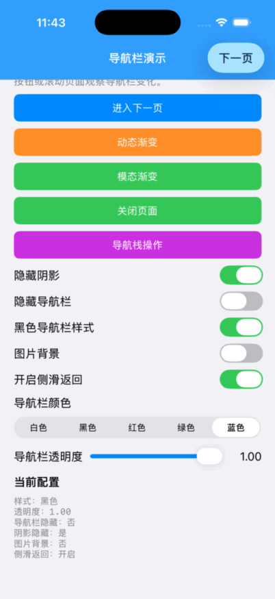

# MonsterNavigationBar

一个基于 Swift/UIKit 的导航栏平滑转场组件，适用于 iOS 12 及以上系统。

本项目移植自 [listenzz/HBDNavigationBar](https://github.com/listenzz/HBDNavigationBar)，。它解决了导航控制器在 push、pop 和交互式返回时导航栏状态突变的问题，让背景颜色、背景图片、透明度、阴影、标题属性和按钮颜色连续过渡。

## 功能演示



GIF 展示的是实际运行中的 Demo 录屏，主要过程如下：

1. 首页提供导航栏颜色、透明度、阴影、背景图片、黑色样式和侧滑返回开关。
2. 切换颜色或样式后，导航栏背景与文字颜色立即同步更新。
3. 点击“动态渐变”进入列表页，顶部图片随滚动移动，导航栏透明度和标题颜色随滚动进度渐变。
4. 页面 push、pop 和模态展示都使用同一套导航栏转场协调逻辑。

完整 Demo 还包含图片背景、返回根页面、导航栈重定向和交互式侧滑返回等场景。

## 特性

| 能力 | 说明 |
| --- | --- |
| 背景颜色 | 每个页面可设置独立的 `UIColor`，push/pop 时平滑插值 |
| 背景图片 | 支持每个页面使用独立图片，并参与转场 |
| 透明度 | 支持静态设置或在滚动过程中动态调整 |
| 毛玻璃背景 | 颜色背景通过 `UIVisualEffectView` 渲染，保持系统风格 |
| 阴影控制 | 支持显示、隐藏和自定义 `shadowImage` |
| 标题和按钮颜色 | 标题属性、导航栏 tintColor 在转场期间同步变化 |
| 导航栏显隐 | 只隐藏内容和背景，不移除导航栏视图，保证连续动画 |
| 返回控制 | 可分别控制返回按钮、侧滑返回和交互式返回 |
| 全屏返回 | 可复用 UIKit 系统侧滑 target 实现全屏返回手势 |
| TabBar 过渡 | 导航栏转场时同步处理 TabBar 的显隐和透明度 |
| 导航栈操作 | 提供 `redirect`，支持替换目标控制器之后的整个栈 |
| Delegate 转发 | 保留 UIKit delegate 能力，同时不破坏内部转场协调 |

## 安装

### Swift Package Manager

在 Xcode 中选择 `File > Add Package Dependencies...`，填入：

```text
https://github.com/monstertulin/MonsterNavigationBar.git
```

或者在 `Package.swift` 中添加：

```swift
dependencies: [
    .package(
        url: "https://github.com/monstertulin/MonsterNavigationBar.git",
        from: "1.0.0"
    )
]
```

然后引入模块：

```swift
import MonsterNavigationBar
```

组件不依赖第三方库，最低部署版本为 iOS 12。

## 基础用法

将根导航控制器替换为 `MonsterNavigationController`：

```swift
import UIKit
import MonsterNavigationBar

let first = HomeViewController()
window?.rootViewController = MonsterNavigationController(rootViewController: first)
```

在页面中只设置与全局样式不同的属性：

```swift
final class DetailViewController: UIViewController {
    override func viewDidLoad() {
        super.viewDidLoad()

        monsterBarTintColor = UIColor(red: 0.08, green: 0.10, blue: 0.13, alpha: 0.86)
        monsterTintColor = .white
        monsterBlackBarStyle = true
        monsterBarShadowHidden = true
    }
}
```

## 页面属性

这些属性通过 `UIViewController` 扩展提供，设置在当前页面即可：

| 属性 | 类型 | 默认值 | 说明 |
| --- | --- | --- | --- |
| `monsterBarStyle` | `UIBarStyle` | `.default` | 导航栏明暗样式 |
| `monsterBlackBarStyle` | `Bool` | `false` | `true` 等同于 `barStyle = .black` |
| `monsterBarTintColor` | `UIColor?` | `nil` | 当前页面的背景颜色 |
| `monsterBarImage` | `UIImage?` | `nil` | 当前页面的背景图片 |
| `monsterTintColor` | `UIColor?` | `nil` | 返回按钮和导航栏按钮颜色 |
| `monsterTitleTextAttributes` | `[NSAttributedString.Key: Any]` | 系统默认 | 导航栏标题属性 |
| `monsterBarAlpha` | `CGFloat` | `1` | 导航栏背景透明度，范围 `0...1` |
| `monsterBarHidden` | `Bool` | `false` | 隐藏导航栏内容和背景 |
| `monsterBarShadowHidden` | `Bool` | `false` | 隐藏导航栏底部阴影 |
| `monsterBackInteractive` | `Bool` | `true` | 是否允许交互式返回 |
| `monsterSwipeBackEnabled` | `Bool` | `true` | 是否允许系统侧滑返回 |
| `monsterClickBackEnabled` | `Bool` | `true` | 是否允许点击返回按钮 |
| `monsterSplitNavigationBarTransition` | `Bool` | `false` | 强制拆分导航栏内容与背景进行转场 |

滚动页面动态修改属性后，调用：

```swift
monsterBarAlpha = progress
monsterSetNeedsUpdateNavigationBar()
```

## Demo 功能说明

打开 `Example/NavigationBarDemo.xcodeproj` 后运行 `NavigationBarDemo` scheme：首页各控件对应的功能如下：

| Demo 控件 | 验证内容 |
| --- | --- |
| 进入下一页 | push 不同导航栏配置，观察背景、标题和按钮颜色过渡 |
| 动态渐变 | 滚动顶部图片，观察透明度和标题颜色渐变 |
| 模态渐变 | 以全屏模态方式展示一个新的导航控制器 |
| 关闭页面 | dismiss 模态页面，或 pop 当前页面 |
| 导航栈操作 | 验证 `popToRoot` 和 `redirect` |
| 隐藏阴影 | 动态切换导航栏底部阴影 |
| 隐藏导航栏 | 隐藏内容和背景，同时保持转场连续 |
| 黑色导航栏样式 | 切换深色标题和按钮样式 |
| 图片背景 | 使用渐变图片替换颜色背景 |
| 开启侧滑返回 | 控制系统边缘返回手势 |
| 导航栏颜色 | 在白、黑、红、绿、蓝之间切换背景颜色 |
| 导航栏透明度 | 使用滑块动态调整背景透明度 |

## 返回控制

需要在返回前执行确认逻辑时，继承 `MonsterNavigationController` 并覆盖 `shouldAllowBack(for:)`。返回 `false` 会同时拦截导航栏返回按钮和侧滑返回：

```swift
final class AppNavigationController: MonsterNavigationController {
    override func shouldAllowBack(for viewController: UIViewController) -> Bool {
        // 在这里显示确认 UI，并根据结果决定是否允许返回。
        return viewController.monsterBackInteractive
    }
}
```

如果需要全屏返回，可以复用 UIKit 系统侧滑 target：

```swift
let target = interactivePopGestureRecognizer?.delegate
let pan = UIPanGestureRecognizer(
    target: target,
    action: #selector(handleNavigationTransition(_:))
)
pan.delegate = interactivePopGestureRecognizer?.delegate
view.addGestureRecognizer(pan)
interactivePopGestureRecognizer?.isEnabled = false
```

## 导航栈重定向

`redirect` 会删除目标控制器之后的页面，再把新控制器放入栈顶：

```swift
navigationController?.redirect(
    to: LoginViewController(),
    animated: true
)

navigationController?.redirect(
    to: HomeViewController(),
    target: oldHome,
    animated: false
)
```

## 运行和验证

### Xcode

1. 打开 `Example/NavigationBarDemo.xcodeproj`。
2. 选择 `NavigationBarDemo` scheme 和任意 iPhone Simulator。
3. 按 `Cmd + R` 运行 Demo。

### 命令行编译

下面的命令只做编译检查，不需要签名：

```bash
xcodebuild \
  -project Example/NavigationBarDemo.xcodeproj \
  -scheme NavigationBarDemo \
  -destination 'generic/platform=iOS Simulator' \
  -derivedDataPath /tmp/monster-demo-derived \
  CODE_SIGNING_ALLOWED=NO \
  build
```

安装到已启动的模拟器：

```bash
xcrun simctl install booted \
  /tmp/monster-demo-derived/Build/Products/Debug-iphonesimulator/NavigationBarDemo.app
xcrun simctl launch booted com.example.NavigationBarDemo
```

## 实现说明

- `MonsterNavigationBar` 始终保持 `isTranslucent == true`，这是平滑过渡所必需的。
- 背景计算优先级为：页面图片、页面颜色、全局图片、全局颜色、根据 `barStyle` 推导的默认颜色。
- `monsterBarHidden` 只让导航栏内容和背景透明，不从视图层级移除导航栏。
- 透明背景页面默认延伸到导航栏下方；在不透明背景上动态调低 `monsterBarAlpha` 时，设置 `extendedLayoutIncludesOpaqueBars = true`。
- 内部通过转场协调器处理 push、pop、交互式返回和 TabBar 过渡，并把 UIKit delegate 回调转发给 `monsterDelegate`。
- 为兼容旧代码，保留了下划线形式的命名别名，例如 `monster_barAlpha` 和 `monster_setNeedsUpdateNavigationBar`。

## 项目结构

```text
Sources/MonsterNavigationBar/
├── MonsterNavigationBar.swift
├── MonsterNavigationController.swift
├── UINavigationController+Monster.swift
└── UIViewController+Monster.swift
Example/NavigationBarDemo/
└── DemoViewController.swift
Tests/MonsterNavigationBarTests/
└── MonsterNavigationBarTests.swift
Assets/
└── demo.gif
```

## 许可证

本项目采用 MIT License。底层实现参考 [listenzz/HBDNavigationBar](https://github.com/listenzz/HBDNavigationBar)。
